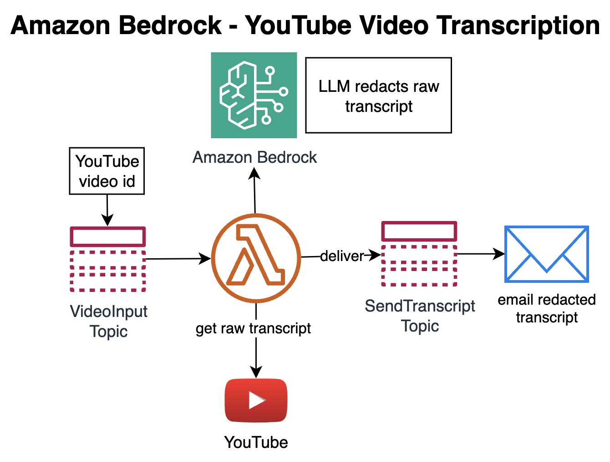

# Let Amazon Bedrock redact raw Youtube video transcripts and get them via email

Who is “**Jana kun**”? Well, that is the famous **Yann LeCun**, as part of a raw transcription in a Youtube Video – raw transcripts contain misspellings, no punctuation, no paragraphs:

“the following is a conversation with Jana kun he's considered to be one of the fathers of deep learning which if …”

For those of you who want to keep the transcripts of such valuable interviews, wait not more. Get the “Bedrock Youtube transcription” which I have published to the Amazon Serverless Application Repository, to receive Amazon Bedrock redacted transcripts via mail.



In the current version, the first 20 minutes of a video are trancribed. Chunking large transcripts I will soon publish in a newer version.

## Steps for using the application:

* At first, deploy the application using the SAM CLI.

* Request model access for Anthropic Claude 3 Haiku:
https://us-east-1.console.aws.amazon.com/bedrock/home?region=us-east-1#/modelaccess

* When the deployment is done, **subscribe your email address** to the SNS Topic that contains the name "VideoInputTopic".

* To request a Youtube video transcript, use the SNS Topic that conains the name "VideoInputTopic" - send a **Youtube video id as a message body**.

* Example: the Youtube video link https://www.youtube.com/watch?v=SGSOCuByo24 shows the 11 digit Youtube id at the very end: **SGSOCuByo24**

Example of a raw video transcript, related to the video above:

```
the following is a conversation with Jana kun he's considered to be one of the fathers of deep learning 
which if you've been hiding under a rock is the recent revolution in AI that's captivated the world with the 
possibility of what machines can learn from data he's a professor in New York University a vice president 
and chief AI scientist a Facebook & Co recipient of the Turing Award for his work on deep learning he's 
probably best known as the founding father of convolutional neural networks in particular their application 
to optical character recognition and the famed M NIST data set he is also an outspoken personality unafraid 
to speak his mind in a distinctive French accent and explore provocative ideas both in the rigorous medium 
of academic research and the somewhat less rigorous medium of Twitter and Facebook this is the artificial 
intelligence podcast if you enjoy it subscribe on YouTube give it five stars on iTunes support and on patreon 
we're simply gonna equip me on Twitter Alex Friedman spelled the Fri D ma N and now here's my conversation 
with Yann Laocoon ...
```

Respective output from Amazon Bedrock, using Anthropic's "Claude 3 Haiku":

The following is a conversation with Yann LeCun. He's considered to be one of the fathers of deep learning, which, if you've been hiding under a rock, is the recent revolution in AI that's captivated the world with the possibility of what machines can learn from data.

He's a professor at New York University, a vice president and chief AI scientist at Facebook, and a Co-recipient of the Turing Award for his work on deep learning. He's probably best known as the founding father of convolutional neural networks, in particular their application to optical character recognition and the famed MNIST data set.

He is also an outspoken personality, unafraid to speak his mind in a distinctive French accent, and explore provocative ideas both in the rigorous medium of academic research and the somewhat less rigorous medium of Twitter and Facebook.

This is the Artificial Intelligence Podcast. If you enjoy it, subscribe on YouTube, give it five stars on iTunes, support us on Patreon, and follow me on Twitter, Alex Fridman, spelled F-R-I-D-M-A-N. And now, here's my conversation with Yann LeCun.

## Deletion

The application can be deleted by simply invoking "sam delete" from the command line.

## License

MIT License
